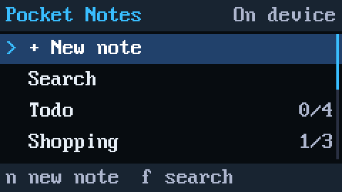
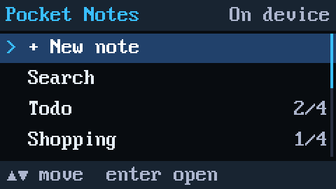
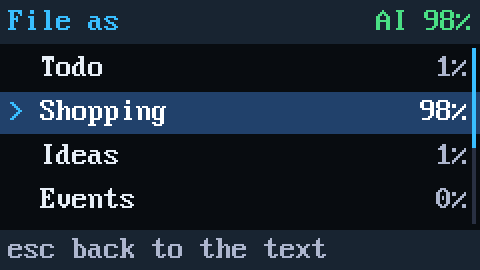
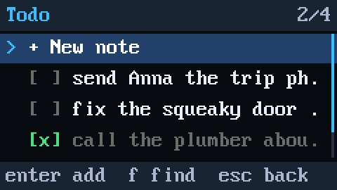
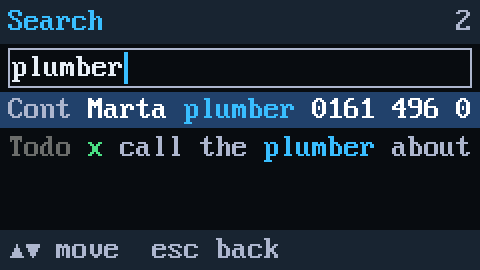
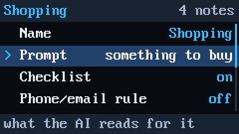

<p align="center">
  
</p>

<h1 align="center">Pocket Notes</h1>

<p align="center">
  <b>A note app for the M5Stack Cardputer that files each note in the right list for you.</b><br>
  Type a thought and press Enter. A small AI model on the chip picks the list.<br>
  It runs offline and needs no phone or account.
</p>

<p align="center">
  <a href="https://github.com/therezor/pocket-notes/releases/latest"><b>⬇️ Download firmware</b></a> ·
  <a href="#-watch-it-work"><b>▶️ Watch it work</b></a> ·
  <a href="#-try-it-in-3-steps"><b>🚀 Try it</b></a> ·
  <a href="#-how-does-it-fit"><b>🔧 How it works</b></a>
</p>

---

## 🎬 Watch it work

<p align="center">
  <a href="https://github.com/therezor/pocket-notes/releases/download/1.0/pocket-notes-demo.mp4"></a>
  <a href="https://github.com/therezor/pocket-notes/releases/download/1.0/pocket-notes-demo.mp4"></a>
  <a href="https://github.com/therezor/pocket-notes/releases/download/1.0/pocket-notes-demo.mp4"></a>
</p>

<p align="center"><a href="https://github.com/therezor/pocket-notes/releases/download/1.0/pocket-notes-demo.mp4"><b>Download the 50-second demo video</b></a>, recorded from the device's own screen at real speed.</p>

In the demo:

1. "buy oat milk and coffee beans" gets the suggestion Shopping at 88%. Enter files it.
2. "dentist thursday 4pm" gets Events at 68%. Enter files it.
3. Two Todo items get ticked.
4. A search for "milk" finds one note and highlights the match.
5. Settings > Categories > Shopping shows the prompt the AI reads for that list, "something to buy".

## 🤯 Why it's different

A plain note app saves text, and the sorting is left to you. In Pocket Notes, a 10-million-parameter
language model on the chip reads each note and picks the list: Shopping, Todo, Events, Contacts,
Ideas, Notes, or lists you make yourself. It runs on an ESP32-S3 with 512 KB of RAM and keeps working
with WiFi off.

It also learns from you. Every note you file becomes an example for its list, and the next guess
uses it. The model isn't retrained, and nothing leaves the device.

## 📊 By the numbers

| | Pocket Notes |
|---|---|
| 🧠 **Model** | TinyDecide, 10.4M parameters, 12 layers, 4-bit weights |
| 💾 **Memory** | 512 KB of RAM, no PSRAM |
| 📦 **Model file** | 6.2 MB, built into the firmware |
| ⚡ **Speed** | about 1.8 s per note, on both CPU cores |
| 🎯 **First guess right** | 62% out of the box, 75% after 5 notes in each list |
| 🗂️ **Storage** | SD card, or 512 KB of the device's own flash |
| 📡 **Internet** | Not needed. WiFi only sets the clock, if you want dates. |

## 📸 Screens

<p align="center">
  
  
  
</p>

## 🧸 What it's good and bad at

| 👍 Good at | 👎 Bad at |
|---|---|
| Quick capture: type, Enter, Enter | Notes that fit two lists, like "call mom at 6pm" (Todo or Events) |
| Shopping items, ideas, phone numbers, emails, times | Long notes, since it reads only the first ~30 words |
| Checklists with completed/total counts | Languages other than English |
| Learning *your* lists as you file notes | Being right every time |

It always shows its pick and waits for Enter, so a wrong guess costs one key press.

## 🚀 Try it in 3 steps

1. **Get a Cardputer.** An [M5Stack Cardputer ADV](https://docs.m5stack.com/en/core/Cardputer-Adv) or the original Cardputer. The same firmware runs on both.
2. **Flash it.** Download `pocket_notes_1.0_full.bin` from [Releases](https://github.com/therezor/pocket-notes/releases/latest) and write it at address `0x0` with the [ESP web flasher](https://espressif.github.io/esptool-js/) or `esptool.py write_flash 0x0 pocket_notes_1.0_full.bin`. To build it yourself, run `cd firmware && pio run -t upload`.
3. **Press `n`, type, press Enter.** You don't need an account or an SD card.

| Key | What it does |
|---|---|
| `n` | new note, and the AI suggests a list |
| `;` `.` | move up / down |
| `Enter` | open, save, file |
| `Space` | tick a checklist item complete or incomplete |
| `f` | search; inside a list, search that list |
| `e` `m` `p` `d` | edit, move, pin, delete |
| `` ` `` or `Del` | back |

The footer shows the keys for the screen you're on.

## 🗂️ Your notes are plain files

The app keeps one Markdown file per list, on the SD card or in device memory. The files open in
Obsidian, and its Tasks plugin reads the checkboxes.

```text
/notes/todo.md          - [ ] call the plumber ^n12
/notes/ideas.md         - solar moisture sensor #pinned ^n9
/notes/categories.txt   Shopping | something to buy | check
```

The Cardputer has no clock, so the app numbers notes and lists them newest first. If you add WiFi in
Settings, the app syncs the clock once at boot and dates new notes.

## 🔧 How does it fit?

1. **It picks from options.** TinyDecide is an encoder that answers a question with one probability per option, in a single pass. Pocket Notes asks it "What kind of note is this?" and gives your lists as the options.
2. **The prompts set the options.** Each list has a prompt, the short text the model reads for it, such as "something to buy" or "a phone number or email". You can edit the prompts in Settings.
3. **The weights are 4-bit.** The firmware reads them straight from flash. A C++ port runs them on both cores with the ESP32-S3's vector (SIMD) instructions, using about 2 KB of RAM per word piece.
4. **It learns without training.** Each list keeps the average vector of its filed notes. The app adds a new note's similarity to that average to the list's score. Two text rules add a little more: a phone number counts toward Contacts and a clock time toward Events.

[docs/PLAN.md](docs/PLAN.md) has the measurements, design notes and status log. To test it:

```sh
node host/notes_eval.mjs                            # accuracy, zero-shot and after learning
node host/make_ref.mjs && sh host/engine_test.sh    # the C++ engine against the JS reference, on a PC
~/.platformio/penv/bin/python tools/remote.py --script tools/smoke.txt   # scripted test on the device
```

<details>
<summary><b>📜 Changelog</b></summary>

- **v1.0**, the first release
  - Lists (categories), with an on-device AI suggestion for every new note. It learns from the notes you file.
  - Checklists with completed/total counts, hide completed, pin, move, edit, delete.
  - Search as you type, across all lists or within one.
  - Settings > Categories edits the names, the AI prompts, the checklist and text-rule flags, and the order.
  - Notes on the SD card or in device memory, with copying between the two.
  - Optional WiFi clock sync. Without it, notes are numbered rather than dated.

</details>

## 📄 License

The code is MIT (see [LICENSE](LICENSE)). The embedded model is TinyDecide (S768 build) by REZOR,
initialised from Google's ELECTRA-small (Apache 2.0); see [model/SOURCE.md](model/SOURCE.md).
Made by REZOR ([@therezor](https://github.com/therezor)).
